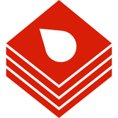

<p align="center">
  
</p>

# Vapor (ASF-inspired)

[](https://github.com/cuihairu/vapor/actions/workflows/ci.yml)
[](https://codecov.io/gh/cuihairu/vapor)
[](https://github.com/cuihairu/vapor/releases)
[](LICENSE)
[](https://dotnet.microsoft.com/)
[](https://learn.microsoft.com/dotnet/csharp/)
[](#development-status)

API-controlled, headless Steam automation platform designed for large-scale batch operations and multi-region deployment.

Instead of one all-in-one process per machine (the ASF model), Vapor splits into a **centralized control plane** — public REST API, SQLite-backed orchestration, audit logs, web consoles — and a fleet of **headless agents** that execute jobs over an outbound WebSocket tunnel, close to Steam's regional endpoints. One control plane can steer agents in every region; agents reach the control plane, never the other way around.

## Highlights

- **Session engine** — persistent Steam bot sessions with credential login + token refresh, SteamGuard / 2FA challenge handling, TOTP and QR-code login, and SDA/steamguard-cli `.maFile` import.
- **37+ actions** — card farming, playtime boosting, trading (offers, loot, 1:1 duplicate swaps), market listings (read/create/cancel with fee-aware pricing), inventory & duplicates scanning, achievement management, key redemption, free-license claiming, points-shop claiming, proxy & account standing checks, and more. See the [actions catalog](docs/actions.md).
- **Desired-state orchestration** — declare `online` / `idle` / `farm` / `boost` per account; the reconciler converges reality to the spec, rotates farming targets as card drops run out, reassigns accounts when an agent disappears. `GET /v1/orchestration/farm` shows the live farm loop.
- **Safety by default** — market listing creation and cancels ship with `dry_run` defaults and per-account + per-agent double switches; trade auto-accept requires an explicit per-account policy with a partner whitelist and gifts-only mode; every decision lands in the audit log.
- **Plugin platform** — ALC-isolated, hot-unloadable plugins with manifests, SemVer API compatibility, trust levels and permission grants, a runtime PluginStore (catalog → agent-targeted install), and four in-tree official plugins (MobileAuthenticator, Monitoring, MarketWatch, TestPlugin). See [plugin development](docs/plugins.md).
- **Operations** — OpenAPI/Swagger, SSE event streams (jobs, sessions, auth challenges), Prometheus metrics + Grafana dashboard, OpenTelemetry tracing across the agent tunnel, HMAC-signed webhooks, structured logs with output-level redaction of credentials and codes.
- **Security** — AES-GCM encrypted credential stores with key rotation tooling, per-role API keys, audit log with redaction-at-rest, and a hard rule: Steam Guard codes and credentials never leave the agent (only a boolean crosses the wire).

## Architecture at a glance

```
                    ┌────────────────────────────────────────────┐
                    │               Control Plane                │
   operators ──────▶│  REST /v1 (50 endpoints) · OpenAPI · SSE   │
   (curl / UI)      │  SQLite: jobs · accounts · audit · crawl   │
                    │  DesiredStateReconciler · schedulers       │
                    │  admin.html · dashboard.html · gamedata    │
                    └───────────────┬────────────────────────────┘
                                    │ outbound WSS tunnel (agent key)
                    ┌───────────────┴──────────┐  ┌──────────────┐
                    │         Agent #1         │  │   Agent #N   │   ← one per region
                    │  session engine (bots)   │  │              │
                    │  37+ actions · plugins   │  │   plugins    │
                    │  encrypted credentials   │  │              │
                    └───────────────┬──────────┘  └──────┬───────┘
                                    │                    │
                                    ▼                    ▼
                               Steam network       Steam network
```

## Quick start

Docker Compose (control plane + one agent):

```bash
git clone https://github.com/cuihairu/vapor.git
cd vapor
docker compose up -d                                # + --profile observability for Prometheus/Grafana
curl -s http://127.0.0.1:8080/healthz
```

Declare an account and run your first job (dev key defaults, see [docker.md](docs/docker.md) for the variable table):

```bash
curl -sS -X PUT http://127.0.0.1:8080/v1/accounts/acct-1 \
  -H "Authorization: Bearer admin-dev-token" -H "Content-Type: application/json" \
  -d '{"enabled":true,"desiredState":"Online","region":"eu-west","agentId":"agent-1","updatedBy":"quickstart"}'

curl -sS -X POST http://127.0.0.1:8080/v1/jobs \
  -H "Authorization: Bearer admin-dev-token" -H "Content-Type: application/json" \
  -d '{"action":"ping","region":"eu-west","targets":["acct-1"]}'
```

Then open the consoles: [`/admin.html`](http://127.0.0.1:8080/admin.html) (full management UI) · [`/dashboard.html`](http://127.0.0.1:8080/dashboard.html) (read-only) · [`/gamedata.html`](http://127.0.0.1:8080/gamedata.html) (game data dictionary). The full walkthrough — login, challenges, farming, plugins — is in [docs/getting-started.md](docs/getting-started.md).

## Documentation

| Section | Contents |
|---------|----------|
| **Getting started** | [Walkthrough](docs/getting-started.md) · [Local run](docs/running.md) · [Docker & Compose](docs/docker.md) · [Production deployment](docs/production.md) |
| **Reference** | [REST API](docs/api.md) · [Actions catalog](docs/actions.md) · [Data dictionary](docs/data-dictionary.md) · [Performance](docs/performance.md) · [Releasing](docs/releasing.md) |
| **Design** | [Architecture](docs/architecture.md) · [Session engine](docs/session-engine.md) · [Plugin development](docs/plugins.md) · [Feature matrix (vs. ASF)](docs/feature-matrix.md) |
| **Operations** | [Troubleshooting](docs/troubleshooting.md) · [Testing](tests/TESTING.md) |
| **Project** | [Changelog](CHANGELOG.md) · [Contributing](CONTRIBUTING.md) · [Security policy](SECURITY.md) · [Support](SUPPORT.md) |

## Requirements

- Runtime: .NET 10 (apps/tests target `net10.0`)
- SDK: 10.x (recommended)
- Language: C# (via Directory.Build.props)

## Testing

- Run tests: `./scripts/run-tests.sh` (or `pwsh ./scripts/run-tests.ps1`)
- Coverage: `./scripts/run-tests.sh --coverage`; full-solution gate runs use `./scripts/collect-coverage-serial.sh` (per-project collection with report validation)
- Tests require the .NET 10 runtime; `DOTNET_ROLL_FORWARD=Major` can bridge an older runtime.

## Releases

- Versions: SemVer tags `vX.Y.Z` (see `docs/releasing.md`)
- Changelog: `CHANGELOG.md`

## Development status

Vapor is currently **alpha** (breaking changes expected).

## License

Apache-2.0, see `LICENSE`.

## Contributing

See `CONTRIBUTING.md` and `SECURITY.md`.

## Support

See `SUPPORT.md`.
