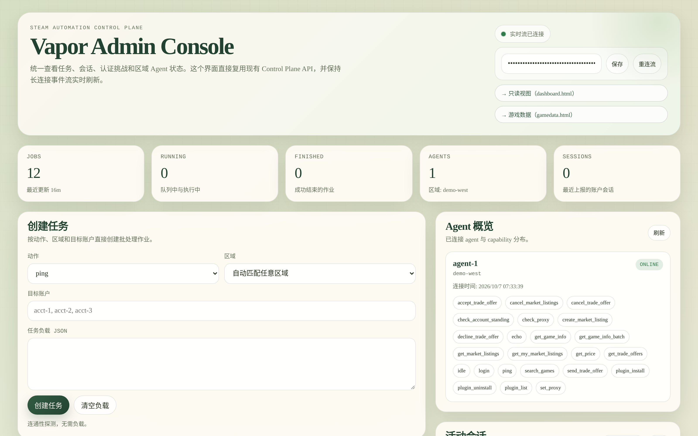
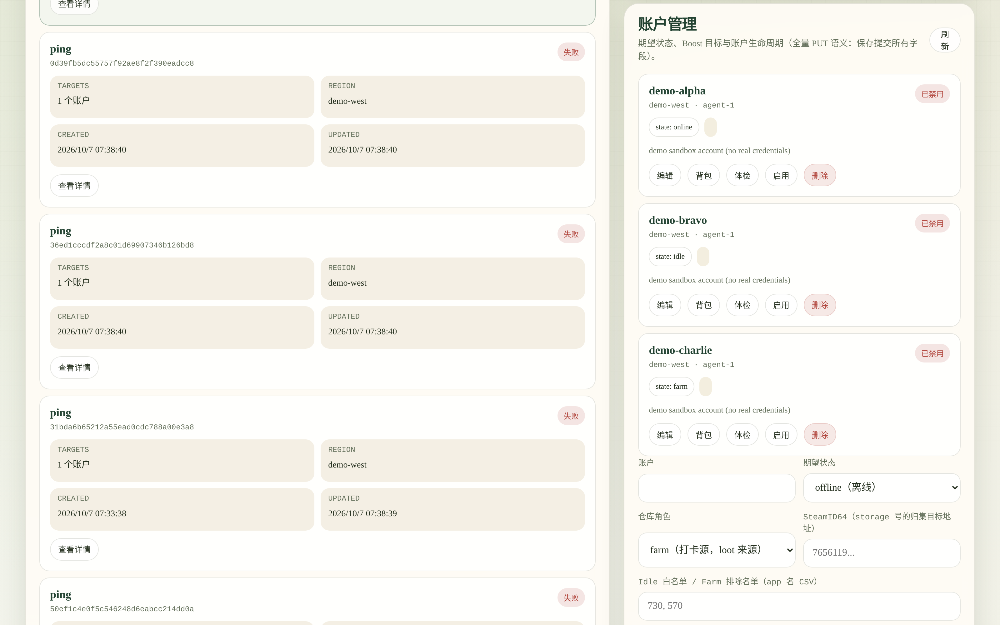
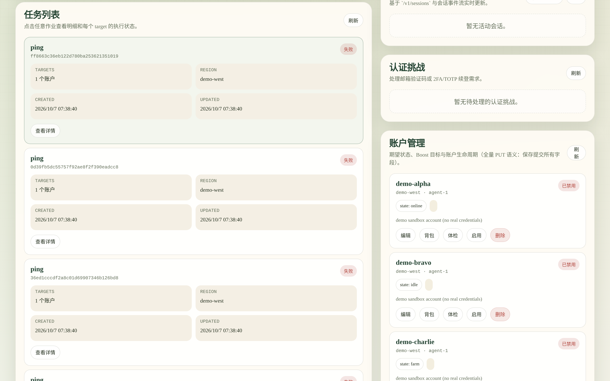
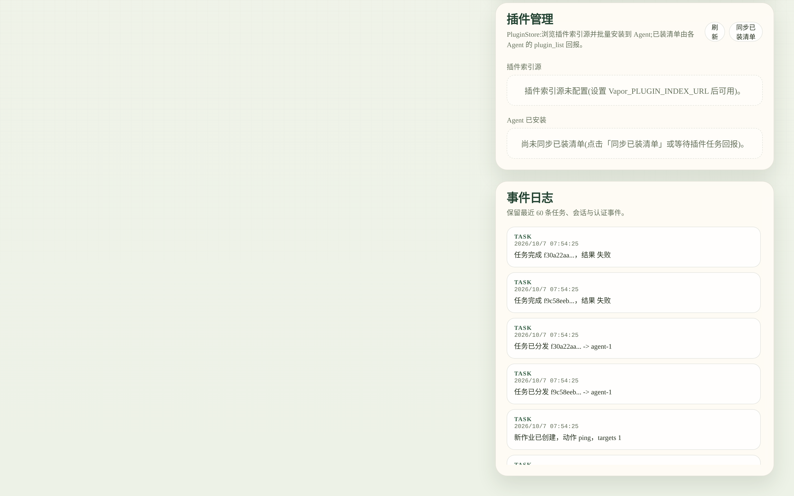

<p align="center">
  
</p>

<div align="center">

[English](README.md) | 简体中文

</div>

# Vapor — 分布式 Steam 自动化控制平面

[](https://github.com/cuihairu/vapor/actions/workflows/ci.yml)
[](https://codecov.io/gh/cuihairu/vapor)
[](https://github.com/cuihairu/vapor/releases)
[](LICENSE)
[](https://dotnet.microsoft.com/)
[](https://learn.microsoft.com/dotnet/csharp/)
[](#开发状态)

API 驱动的无头 Steam 自动化平台，面向大规模批量操作与多区域部署。设计灵感来自 [ArchiSteamFarm](https://github.com/JustArchiNET/ArchiSteamFarm) 的 Bot/Action 模型。

Steam 协议层基于 [SteamKit2](https://github.com/SteamRE/SteamKit2) 构建；产品形态复用了 ASF 的 bot-session 概念，但采用控制平面 / Agent 分离架构，而非每台机器一个进程。一个控制平面即可调度各区域的 Agent，就近连接 Steam 区域端点。Agent 主动连接控制平面，反向则不通。

## 亮点

每个账号作为一个持久的 Steam bot 会话运行：凭据登录与令牌刷新、SteamGuard / 2FA 挑战、TOTP 与二维码登录，以及从 SDA 或 steamguard-cli 导入 `.maFile`。在此之上提供 59 个动作——卡牌挂机、游戏时长提升、交易报价、带手续费感知定价的市场挂单、库存与重复物品扫描、成就管理、CDK 兑换、免费入库与积分商城兑换。每个动作都带有执行安全等级，调度器正是据此将可能重复触发外部副作用的动作重派上限设为 2 次，而只读与幂等动作仍使用配置的常规上限。[动作目录](docs/actions.md)列出了每个动作的全部载荷字段。

声明式编排：你只需为每个账号声明 `online` / `idle` / `farm` / `boost`，调和器（reconciler）会将实际状态收敛到该声明——卡牌掉落耗尽时轮换挂机目标，Agent 掉线时重新分配账号。`GET /v1/orchestration/farm` 可查看实时循环。

高风险接口默认关闭。市场挂单创建与撤单默认 `dry_run`，需要账号级与 Agent 级双重开关；交易自动接受需要显式的账号级策略，并带联系人白名单与仅赠送模式。上述每一项决策都会落入审计日志。

插件加载到隔离的 AssemblyLoadContext 中，无需重启即可卸载。清单（manifest）携带 SemVer API 契约、信任级别与权限授权；运行时 PluginStore 可从目录安装指定 Agent 的插件包。六个官方插件随仓库内建：Monitoring、MobileAuthenticator、MarketWatch、CaseOpening、GameData、GameAccess——最后一个以线上兼容的方式从宿主中抽离出游戏访问动作面。参见[插件开发](docs/plugins.md)。

运维方面：控制中心脚本仓库（存档运维脚本并定向派发到已连接 Agent）与脚本编排（顺序步骤、每步状态、失败即停/继续策略）、OpenAPI/Swagger、SSE 事件流（任务、会话、认证挑战）、Prometheus 指标与 Grafana 面板、横跨 Agent 隧道的 OpenTelemetry 追踪、HMAC 签名的 Webhook，以及在输出时对凭据与验证码脱敏的结构化日志。安全姿态包括 AES-GCM 加密凭据存储与密钥轮换工具、按角色的 API Key、落盘即脱敏的审计日志——并恪守一条硬性规则：Steam Guard 验证码与凭据永不离开 Agent，跨网络传输的只有一个布尔值。

## 架构一览

```
                    ┌────────────────────────────────────────────┐
                    │               Control Plane                │
   operators ──────▶│  REST /v1 (58 routes / 68 ops) · OpenAPI·SSE│
   (curl / UI)      │  SQLite: jobs · accounts · audit · crawl   │
                    │  DesiredStateReconciler · schedulers       │
                    │  admin.html · dashboard.html · gamedata    │
                    └───────────────┬────────────────────────────┘
                                    │ outbound WSS tunnel (agent key)
                    ┌───────────────┴──────────┐  ┌──────────────┐
                    │         Agent #1         │  │   Agent #N   │   ← one per region
                    │  session engine (bots)   │  │              │
                    │  59 actions · plugins   │  │   plugins    │
                    │  encrypted credentials   │  │              │
                    └───────────────┬──────────┘  └──────┬───────┘
                                    │                    │
                                    ▼                    ▼
                               Steam network       Steam network
```

## 演示站点 (Live demo)

**演示站点 https://vapor.cuihairu.site/ ｜ 演示账号 `demo` / `demo-899d0e86ad4d1c524da9c47a9d0f160e`（体验用，数据定期重置）**

- 演示密钥是专用的**只读沙箱**：它只放行 REST API 与两个控制台的读取请求（GET/HEAD），所有写操作——任务创建、账号变更、Agent 调度——都会以 `401` 拒绝。真正的管理密钥只存在于部署机上，绝不公开。
- 登录：打开 [`/admin.html`](https://vapor.cuihairu.site/admin.html)（管理台）
  或 [`/dashboard.html`](https://vapor.cuihairu.site/dashboard.html)（只读面板），
  在 API Key 输入框粘贴演示密码即可登录。
- 由 CI 从 `main` 直接部署：只有完整测试门禁（全绿测试套件 + 100% 行/分支覆盖率）与镜像构建都通过时才会部署，失败自动回滚。演示数据在每次部署时重置——一个演示 Agent 保持在线，预置的演示账号与任务让控制台始终有内容可看。
- 账号为演示专用（非真实管理员账号）；请勿在演示实例中输入任何真实 Steam 凭据。

### 预览 (Preview)

| 控制平面控制台 | 账号舰队 |
|---|---|
|  |  |
| **任务历史** | **实时事件流** |
|  |  |

## 快速开始

Docker Compose（控制平面 + 一个 Agent）：

```bash
git clone https://github.com/cuihairu/vapor.git
cd vapor
docker compose up -d                                # + --profile observability 启用 Prometheus/Grafana
curl -s http://127.0.0.1:8080/healthz
```

声明一个账号并运行首个任务（开发密钥默认值见 [docker.md](docs/docker.md) 的变量表）：

```bash
curl -sS -X PUT http://127.0.0.1:8080/v1/accounts/acct-1 \
  -H "Authorization: Bearer ***" -H "Content-Type: application/json" \
  -d '{"enabled":true,"desiredState":"Online","region":"eu-west","agentId":"agent-1","updatedBy":"quickstart"}'

curl -sS -X POST http://127.0.0.1:8080/v1/jobs \
  -H "Authorization: Bearer ***" -H "Content-Type: application/json" \
  -d '{"action":"ping","region":"eu-west","targets":["acct-1"]}'
```

然后打开控制台：[`/admin.html`](http://127.0.0.1:8080/admin.html)（完整管理界面） · [`/dashboard.html`](http://127.0.0.1:8080/dashboard.html)（只读优先，仅一个白名单调和动作） · [`/gamedata.html`](http://127.0.0.1:8080/gamedata.html)（游戏数据字典）。完整上手流程——登录、挑战、挂机、插件——见 [docs/getting-started.md](docs/getting-started.md)。

## 文档

| 板块 | 内容 |
|---------|----------|
| **入门** | [上手指南](docs/getting-started.md) · [本地运行](docs/running.md) · [Docker 与 Compose](docs/docker.md) · [生产部署](docs/production.md) |
| **参考** | [REST API](docs/api.md) · [动作目录](docs/actions.md) · [数据字典](docs/data-dictionary.md) · [性能](docs/performance.md) · [依赖策略](docs/dependencies.md) · [发布流程](docs/releasing.md) |
| **设计** | [架构](docs/architecture.md) · [领域模型](docs/domain-model.md) · [一致性模型](docs/consistency.md) · [会话引擎](docs/session-engine.md) · [插件开发](docs/plugins.md) · [功能矩阵（vs. ASF）](docs/feature-matrix.md) |
| **运维** | [故障排查](docs/troubleshooting.md) · [测试](tests/TESTING.md) |
| **项目** | [变更日志](CHANGELOG.md) · [贡献指南](CONTRIBUTING.md) · [安全策略](SECURITY.md) · [支持](SUPPORT.md) |

## 环境要求

- 运行时：.NET 10（应用与测试目标框架为 `net10.0`）
- SDK：10.x（推荐）
- 语言：C#（经 Directory.Build.props 配置）

## 测试

- 运行测试：`./scripts/run-tests.sh`（或 `pwsh ./scripts/run-tests.ps1`）
- 覆盖率：`./scripts/run-tests.sh --coverage`；完整解决方案门禁使用 `./scripts/collect-coverage-serial.sh`（逐项目采集并校验报告）
- 测试需要 .NET 10 运行时；`DOTNET_ROLL_FORWARD=Major` 可兼容较旧的运行时。

## 发布

- 版本：SemVer 标签 `vX.Y.Z`（见 `docs/releasing.md`）
- 变更日志：`CHANGELOG.md`

## 开发状态

Vapor 目前处于 **alpha** 阶段（可能出现破坏性变更）。

## 许可证

Apache-2.0，见 `LICENSE`。

## 参与贡献

见 `CONTRIBUTING.md` 与 `SECURITY.md`。

## 支持

见 `SUPPORT.md`。
