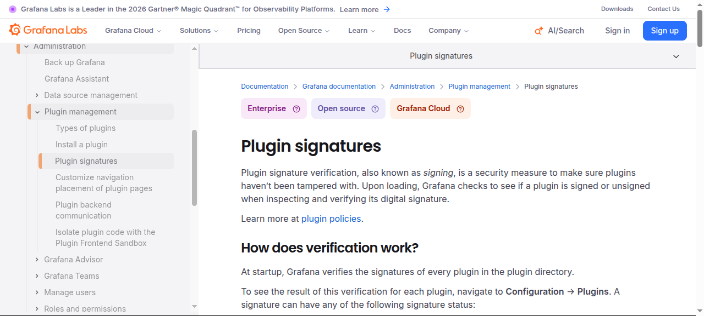
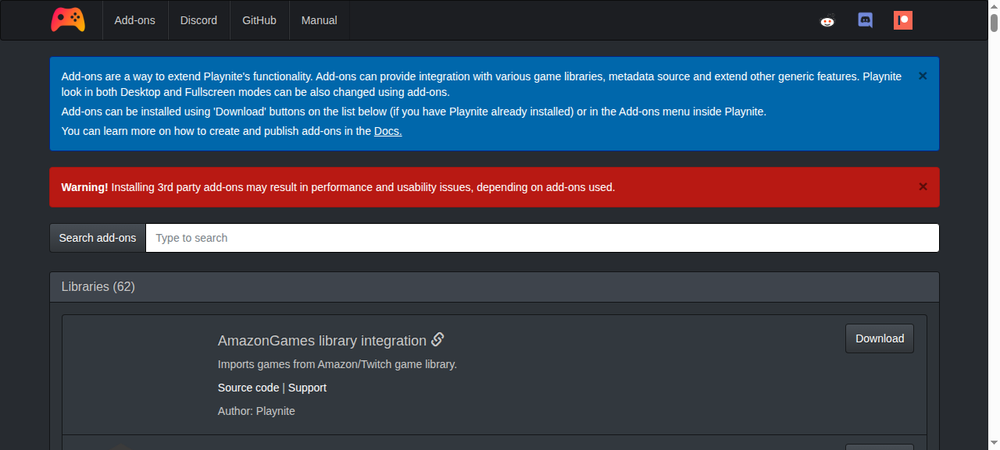
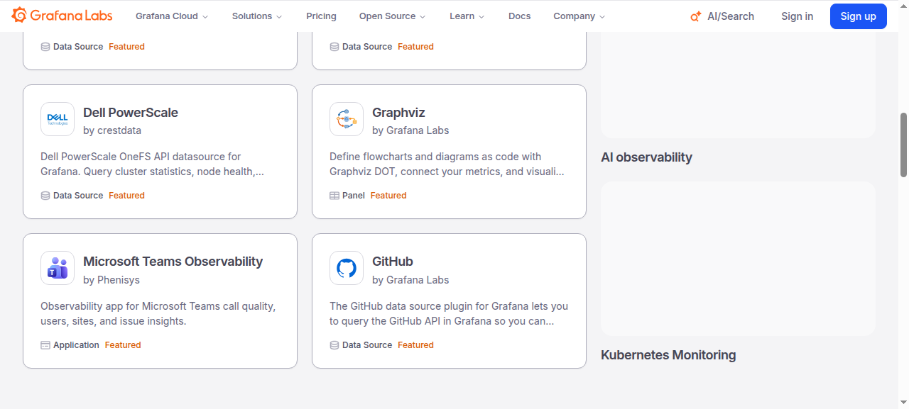

# 市场调研:同类功能点与插件设计(2026-10-08)

> 方法:先读本仓 README 与 docs 确认定位,再选市面代表产品。功能对照与 `docs/feature-matrix.md` 分工:那份是五家直接同类的能力域矩阵(2026-09-13 起多轮收口),本文补两块:邻近品类(游戏库/启动器/存档)的功能面,以及插件机制的逐维拆解。外部论断后附来源链接;截图内嵌正文对应位置、存 `docs/research/assets/`,均注明出处与截取日期(2026-10-08)。vapor 现状一律以仓内文档为准,不作预测。

## 1. 对照对象与口径

vapor 的定位与家底(来自本仓文档):API 控制的无头 Steam 自动化平台,控制面 + 分区 Agent(README);57 个动作(`docs/actions.md`),`/v1` 58 条路由 / 68 个操作(`docs/api.md` 引言);6 个官方插件,插件机制含清单、信任、权限、可收集 ALC 隔离与运行时 PluginStore(`docs/plugins.md`)。

对照分两组,共 11 个产品。**摘要**:直接同类 5 家逐项对功能面找缺口,基线与邻近 6 家划「不做什么」的边界、并给第 4 节供插件机制参照:

| 组 | 产品 | 为什么选它 |
|----|------|-----------|
| 直接同类(5) | [ArchiSteamFarm](https://github.com/JustArchiNET/ArchiSteamFarm/wiki)、[Steam Desktop Authenticator](https://github.com/Jessecar96/SteamDesktopAuthenticator)、[Watt Toolkit (Steam++)](https://github.com/BeyondDimension/SteamTools)、[Steam Game Idler](https://github.com/zevnda/steam-game-idler)、[steamguard-cli](https://github.com/dyc3/steamguard-cli) | 同为 Steam 账号侧自动化/令牌工具,与 vapor 功能面直接重叠 |
| 基线与邻近(6) | [Steam 官方客户端](https://help.steampowered.com/en/faqs/view/7EFD-3CAE-64D3-1C31)、[Playnite](https://playnite.link/)、[Heroic Games Launcher](https://github.com/Heroic-Games-Launcher/HeroicGamesLauncher)、[Lutris](https://github.com/lutris/lutris)、[GOG Galaxy](https://github.com/gogcom/galaxy-integrations-python-api)、[Ludusavi](https://github.com/mtkennerly/ludusavi) | 确认「Vapor 不做什么」的边界,同时提供第 4 节的插件机制参照(Playnite/GOG Galaxy/Heroic) |

## 2. 直接同类:功能清单对照

**结论**:五家直接同类逐行核完没有整块功能缺失,真缺口收敛到三处,按价值排序是插件更新检查、Steam 聊天控制面、成就解锁节奏与退款窗口识别;其余差异都属定位外(网络加速、本地账号切换、通用令牌保险箱),`docs/feature-matrix.md` 已单列「明确不采用」。

| 产品(形态) | 功能清单(摘) | vapor 覆盖 | 缺口 / 判断 |
|---|---|---|---|
| **ArchiSteamFarm**(C# 守护进程,多账号 bot) | 挂卡与换卡、IPC + ASF-ui、Steam 聊天里发命令(默认 `!` 前缀,按 EAccess 分级)、per-bot WebProxy、官方插件(MEF2/System.Composition 约定发现)、官方插件按宿主版本自动更新 | 挂卡/换卡/代理/REST/插件全覆盖,另有多账号舰队与期望状态编排(ASF 单进程没有) | **两条真缺口**:①聊天控制面,ASF 能在 Steam 私聊/群聊里执行命令([Commands wiki](https://github.com/JustArchiNET/ArchiSteamFarm/wiki/Commands)),vapor 的交互面只有 REST/SSE/两个控制台;②插件更新检查,ASF 官方插件按宿主版本自动更新(`docs/plugins.md` §Alignment),vapor PluginStore 只有 `plugin_install`/`plugin_uninstall`/`plugin_list`(`docs/plugins.md` §PluginStore) |
| **Steam Desktop Authenticator**(桌面令牌工具) | 2FA 代码、交易/市场确认、maFile 加密存储、QR 扫码登录;官方 README 声明已停止维护、不再更新 | TOTP、确认、maFile 导入(`import-mafile`)、QR 登录均覆盖(`docs/feature-matrix.md` §3.1) | ①「移除令牌」(Remove Authenticator,带撤销码)在 57 个动作里没有对应项,Steam 官方支持该流程([Steam Guard FAQ](https://help.steampowered.com/en/faqs/view/7EFD-3CAE-64D3-1C31));②SDA 停止维护,存量 maFile 用户的迁移窗口是真实存在的 |
| **Watt Toolkit / Steam++**(跨平台桌面工具箱) | 3.0 支持自定义插件(默认插件可删可禁)、网络加速(YARP 本地反代 + JS 注入)、账号切换、库存游戏(模拟运行挂卡、云存档管理、成就解锁)、本地令牌(TOTP/HOTP、批量确认);README 中「自动挂卡(集成 ASF)」一项已划线标注开发中 | 挂卡、确认、成就覆盖;加速、账号切换、通用 TOTP 保险箱属「明确不采用」(`docs/feature-matrix.md` §4) | 无实质缺口。附带发现:feature-matrix 里「Watt 内嵌 ASF 挂卡」一行以 2026-09 的版本为准,当前 README 已划线,属时点差,下轮矩阵维护时可回填 |
| **Steam Game Idler**(桌面应用,多账号) | 两阶段卡牌引擎(最多 32 并发)、跳过退款窗口内游戏、黑白名单、自动挂卡、成就解锁(拟人节奏、可导入他人的解锁时序)、时长 boost、库存与市场挂单、免费游戏认领,无需本地 Steam 客户端 | farming、成就、boost、库存、市场、免费认领全部覆盖(`docs/feature-matrix.md` §3.2/§3.5/§3.6,成就 2026-09-18 落地) | 两条细节缺口:①farm 队列不识别 Steam 退款窗口(全仓无 refund 相关实现);②`unlock_achievements` 是显式单发写入,没有拟人节奏与解锁时序导入。两项都不压 GA 出口条件,属体验层 |
| **steamguard-cli**(Rust CLI,单账号 × 多 maFile) | 2FA 生成、确认响应、密钥加密存储(可挂系统 keyring)、QR 导出与 QR 登录、SDA maFile 互操作、防泄漏的内存数据结构 | 全覆盖,且是多账号服务端形态 | 无。定位不同:单机 CLI 对服务端舰队,不是同一类采购决策 |

## 3. 基线与邻近品类:功能清单对照

**结论**:六家全是个人桌面端形态,没有一家有多租户、编排或审计面,与 vapor 不构成竞争;可迁移的经验只有两条且都在插件侧——GOG Galaxy 的进程隔离、Playnite 的第三方扩展风险提示与目录运营。列它们的作用是划清边界,并给第 4 节提供插件参照。

| 产品 | 功能清单(摘) | 与 vapor 的关系 |
|---|---|---|
| **Steam 官方客户端** | 桌面库/下载/商店/社交;Steam Guard 手机令牌(30 秒换码、QR 扫码登录、可移除令牌,[官方 FAQ](https://help.steampowered.com/en/faqs/view/7EFD-3CAE-64D3-1C31));交易与市场确认([官方 FAQ](https://help.steampowered.com/en/faqs/view/2E6E-A02C-5581-8904));Steam Cloud 存档([Steamworks](https://partner.steamgames.com/doc/features/cloud));Steam Families 最多 6 名成员与家长控制([官方 FAQ](https://help.steampowered.com/en/faqs/view/054C-3167-DD7F-49D4)) | 定位外:无 GUI、不安装游戏、不做家庭组。vapor 跑在它的协议与 Web API 之上(SteamKit2 底座,README);Guard 与确认两环已闭环 |
| **Playnite**(开源库管理器) | 从 15+ 商店与模拟器聚合游戏库、时长追踪、元数据抓取、桌面/全屏双模式;扩展分插件(.NET)与脚本(PowerShell)两类,清单为 `extension.yaml`([官方文档](https://api.playnite.link/docs/tutorials/extensions/extensionsManifest.html)) | 库聚合与启动定位外;插件机制见 §4,add-ons 页 Libraries 分类有 62 个扩展(图 2) |
| **Heroic Games Launcher** | Epic/GOG/Amazon 三商店(分别走 Legendary、gogdl、nile)、Wine/Proton 管理、云存档同步、下载队列、导入本地游戏;扩展能力只有 CSS:自定义主题目录,以及设置里的 Custom CSS 注入([Custom Themes wiki](https://github.com/Heroic-Games-Launcher/HeroicGamesLauncher/wiki/Custom-Themes)) | 定位外;插件反例,见 §4.2 末 |
| **Lutris**(Python 桌面客户端) | 用 JSON/YAML 安装脚本自动化安装游戏、runner(模拟器/兼容层)管理、与 lutris.net 账户同步库(客户端只存 token,不存密码)、SQLite 库存 | 定位外。安装脚本是数据驱动的 DSL,与 vapor 的动作注册表不是一类抽象,不作类比 |
| **GOG Galaxy** | 桌面聚合客户端;社区集成以独立 Python 进程实现,与客户端走 JSON-RPC,清单为 `manifest.json`,依赖随包自带([官方 Python API README](https://github.com/gogcom/galaxy-integrations-python-api)) | 定位外;进程隔离的参照,见 §4.2 |
| **Ludusavi**(Rust 存档备份) | 19,000+ 游戏存档备份/恢复,覆盖 Steam/GOG/Epic/Heroic/Lutris 库,GUI + CLI,可作 Playnite 扩展([README](https://github.com/mtkennerly/ludusavi)) | 定位外:vapor 不碰游戏本地文件与存档 |

## 4. 插件机制调研(7 个参照)

参照选取覆盖三类宿主:桌面应用(VS Code、Obsidian、Playnite、Heroic)、可观测平台(Grafana)、游戏平台聚合(GOG Galaxy),外加 vapor 插件机制的直接祖型 ASF。

### 4.1 七维对照表

**摘要**:七家的走向高度一致——契约=清单文件+宿主 API,版本=插件声明最低宿主版本,沙箱做到位靠进程;分歧集中在权限与分发,逐条规律见 §4.3。

| 参照 | 契约(清单 + 宿主 API) | 发现 | 权限与信任 | 隔离 / 沙箱 | 版本兼容 | 分发与更新 |
|---|---|---|---|---|---|---|
| **VS Code** | `package.json`:必填 `name`/`version`/`publisher`/`engines.vscode`,`contributes` 静态声明贡献点,`activationEvents` 声明激活时机([Extension Manifest](https://code.visualstudio.com/api/references/extension-manifest)) | Marketplace 或本地 VSIX;未激活时宿主已能读到贡献点 | 无 OS 级权限清单;闸门是 Workspace Trust:`capabilities.untrustedWorkspaces` 声明 `true`/`false`/`limited`,未声明的扩展在 Restricted Mode 默认禁用([扩展指南](https://code.visualstudio.com/api/extension-guides/workspace-trust)) | 扩展跑在独立 extension host 进程,禁止直接访问 DOM([Our Approach](https://vscode-docs.readthedocs.io/en/stable/extensions/our-approach/)) | `engines.vscode` 语义化范围,禁止 `*` | Marketplace + 发布者信任提示 |
| **Grafana** | `plugin.json` 必填:`type`(app/datasource/panel/renderer)、`dependencies.grafanaVersion`(已标 deprecated)、`backend` + `executable` 声明子进程二进制([plugin.json 参考](https://grafana.com/developers/plugin-tools/reference/plugin-json)) | 启动时扫描含 `plugin.json` 的插件文件夹 | 数字签名:自 Grafana 7.0 起插件必须签名;`MANIFEST.txt` 装元数据 + 每文件 SHA256 + 私钥签名,Grafana 内置公钥验签;签名级别 private/community/commercial/grafana 决定分发范围;unsigned 默认不加载([Plugin signatures](https://grafana.com/docs/grafana/latest/administration/plugin-management/plugin-sign/)) | backend 插件是独立 Go 可执行文件;前端 Plugin Frontend Sandbox(≥11.5 公开预览)把插件放进独立 JS context,默认关闭,Grafana Labs 自家签名插件被排除([沙箱文档](https://grafana.com/docs/grafana/latest/administration/plugin-management/plugin-frontend-sandbox/)) | `dependencies.grafanaVersion` 声明宿主版本要求 | 官方 plugin catalog + CLI 安装与更新 |
| **Playnite** | `extension.yaml` 必填 `Id`/`Name`/`Version`/`Module`/`Type`(Script / GenericPlugin / GameLibrary / MetadataProvider),插件目标 .NET Framework 4.6.2([清单文档](https://api.playnite.link/docs/tutorials/extensions/extensionsManifest.html)) | 扫描 `Extensions` 目录;开发者把输出目录挂进 External extensions | 无权限模型,插件与宿主同权;官方 add-ons 页挂第三方扩展风险横幅(图 2) | 无,同进程 .NET 加载 | 分发清单的 `RequiredApiVersion` 决定能否安装;SDK 同主版本内向后兼容,加载时校验 SDK 引用,拒绝引用非 SDK 程序集的插件([插件文档](https://api.playnite.link/docs/tutorials/extensions/plugins.html)) | 官方 add-on 数据库,客户端内下载与更新 |
| **GOG Galaxy** | `manifest.json`(`name`/`platform`/`guid`/`version`/`script`)+ 继承 `galaxy.api.plugin.Plugin`([README](https://github.com/gogcom/galaxy-integrations-python-api)) | `plugins/installed` 目录,第三方依赖随包自带(`pip --target`,宿主内置 Python 3.13) | 无声明式权限,能力面就是客户端定义的方法集 | **每个集成独立进程**,与客户端 JSON-RPC 通信,是七家里最硬的边界 | manifest `version` 与构造参数一致,无宿主版本协商 | 手动解压目录,社区 zip 分发 |
| **Obsidian** | `manifest.json`:`id`/`name`/`version`(严格 `x.y.z`)/`minAppVersion`/`author`/`isDesktopOnly`([Manifest 参考](https://docs.obsidian.md/Reference/Manifest)) | `.obsidian/plugins/<id>/` + 社区注册表 `community-plugins.json` | 无权限清单;`isDesktopOnly` 是能力声明(用到 Node/Electron 必须标 `true`,[提交要求](https://docs.obsidian.md/Plugins/Releasing/Submission+requirements+for+plugins)) | 无,Electron 渲染进程内 | `minAppVersion` + `versions.json` 记录每个版本对应的最低宿主 | GitHub release + 社区提交评审 |
| **ASF**(直接祖型) | `IPlugin` + 约 22 个可选能力接口,**无清单文件**;配置走 `GlobalConfig.json` 的 `[JsonExtensionData]` 余量字段([Plugins development wiki](https://github.com/JustArchiNET/ArchiSteamFarm/wiki/Plugins-development)) | System.Composition(MEF2)`[Export]` 约定扫描 | 无权限模型,自定义插件全信任,只有 `-modded` 警告 | 无,默认加载上下文、进程生命周期常驻 | 官方 wiki 明说不承诺编译产物跨版本可用;不匹配以 `TypeLoadException` 呈现(`docs/plugins.md` §Alignment) | 手动放入 `plugins/`;官方插件按宿主版本从 GitHub release 自动更新(opt-in 白名单,重启生效) |
| **Heroic**(反例) | 无清单、无 API;只有主题目录(一个 `.css` 一个主题)与 Custom CSS 注入([Custom Themes wiki](https://github.com/Heroic-Games-Launcher/HeroicGamesLauncher/wiki/Custom-Themes)) | 扫描用户指定的 CSS 目录 | 不适用 | 不适用 | 不适用 | 社区主题仓库提交 |

### 4.2 逐家要点(补充表格之外的判断)

**VS Code 把「信任」和「能力」拆成两件事。** 能力(contributes)在激活之前就静态可读,宿主不用跑插件代码就知道它会占哪些 UI;信任(Workspace Trust)是另一条独立轴,决定这段代码能不能在当前工作区跑。官方文档自己写明这条边界挡不住恶意扩展:「Workspace Trust can't prevent a malicious extension from executing code and ignoring Restricted Mode」([Workspace Trust](https://code.visualstudio.com/docs/editing/workspaces/workspace-trust))。声明式信任的价值不在防住谁,而在于让「未声明」变成默认禁用。

**Grafana 把「来源」做成了机器可验的。** 签名清单把元数据和文件摘要绑在同一份签名里,验签在启动时执行,unsigned 直接不加载。这比「用户自己核对 sha256」强一个量级:摘要不再依赖人工传递,来源与内容一起被验证([Plugin signatures](https://grafana.com/docs/grafana/latest/administration/plugin-management/plugin-sign/),图 1)。它的前端沙箱默认关闭,且官方插件豁免,说明即便是 Grafana 也不敢承诺沙箱内零成本兼容。

**图 1** Grafana 签名机制文档页,「启动时验签、签名状态分级」的原文。来源:<https://grafana.com/docs/grafana/latest/administration/plugin-management/plugin-sign/>,2026-10-08 截取。

**GOG Galaxy 证明进程隔离是可以日常化的。** 每个集成是独立 Python 进程,宿主只暴露 JSON-RPC 方法,依赖随包自带、用宿主内置解释器。代价是进程数与启动开销,收益是崩溃、死循环、依赖冲突都不会波及宿主。

**Playnite 的版本闸门放在安装时而不是加载时。** `RequiredApiVersion` 写在分发清单里,安装器先拒;加载时再校验 SDK 引用是否落在兼容主版本。两道闸,前者挡用户,后者挡打包错误。它同时是「无权限模型 + 官方风险提示」的样本:功能页顶部挂红色横幅提醒第三方扩展可能引发性能与可用性问题(图 2)。

**图 2** Playnite add-ons 页:Libraries 分类 62 个扩展,页顶为第三方扩展风险提示。来源:<https://playnite.link/addons.html>,2026-10-08 截取。

**ASF 是反面参照系。** 无清单、无版本协商、无权限、无隔离,四无的代价写在官方 wiki 里:「you can't assume that your plugin once compiled will keep working with all future ASF releases」。vapor 的插件机制在契约、版本、信任三轴上都是照着 ASF 缺什么补什么(`docs/plugins.md` §Alignment with ASF)。

**Heroic 说明没有插件机制会发生什么。** 扩展需求全部压回主线,社区只能改外观:主题与 CSS 注入是它唯一的出口,库逻辑、商店接入、下载队列都改不动。这条对 vapor 的意义是反向的:插件机制不是锦上添花,它决定了功能面还能不能继续开。

### 4.3 七家能抽出的规律

1. 契约统一是「清单文件 + 宿主 API」,清单最小集是 id、版本、入口、能力声明;没有一家用代码内注册替代清单。
2. 权限只有两种取向:没有(Playnite、Obsidian、ASF,靠评审与声誉),或声明式能力加信任等级(VS Code 工作区信任、Grafana 签名级别)。没有一家给插件提供 OS 级能力沙箱。
3. 版本兼容统一是「宿主定契约、插件声明最低宿主版本」:`engines.vscode`、`RequiredApiVersion`、`minAppVersion`、`dependencies.grafanaVersion` 同构;ASF 是唯一明确不承诺的。
4. 沙箱做到位靠进程:GOG Galaxy 独立进程、Grafana backend 独立二进制、VS Code 扩展宿主进程。同进程方案解决的是版本共存与热卸载,不是越权。
5. 有中心目录的三家(VS Code、Grafana、Playnite)都配了自动更新与风险提示(图 3);手动放置的(GOG Galaxy)更新靠人。

**图 3** Grafana 插件目录,每张卡片标注类型与作者。来源:<https://grafana.com/grafana/plugins/>,2026-10-08 截取。

## 5. vapor 插件机制与参照的逐维对照

**结论**:八维对照里五维对齐或领先(插件间依赖图是七个参照都没有的),隔离弱于进程派三家,真缺口两处——分发无更新通道、来源校验止步于钉摘要;候选处置见 §6。现状列全部出自 `docs/plugins.md`。

| 维度 | vapor 现状 | 参照做法 | 判断 |
|---|---|---|---|
| 契约 | `plugin.json` 必填 `id`/`name`/`version`/`apiVersion`/`entryAssembly`,可选 `trust`/`permissions`/`configuration`/`configurationSchema`/`dependencies`;清单解析宽松、校验严格,非法即报加载失败 | 七家同构:清单 + 宿主 API | 对齐 |
| 发现 | `VAPOR_PLUGINS_DIR` 一插件一子目录启动扫描;运行时 PluginStore 接受 zip 热加载 | 目录扫描为主;目录型三家多一个中心库 | 对齐自托管形态;没有公共目录是取舍不是缺陷 |
| 权限与信任 | `trust` 三档 + `permissions` 四能力位,在插件代码运行前评估,未声明能力被剥离(或严格模式拒绝) | VS Code 工作区信任、Grafana 签名级别同为声明式 | 强于 ASF/Playnite/Obsidian;**能力位只管「注册什么」,不约束插件运行中的文件与网络行为** |
| 隔离 | 每插件独立可收集 ALC,`plugin_uninstall` 热卸载并验证回收 | GOG Galaxy 独立进程、Grafana backend 独立二进制、VS Code 独立扩展宿主进程 | 弱于三家进程派:ALC 不解决越权,也不提供 CPU/内存配额 |
| 版本兼容 | `PluginApi.IsCompatible`:major 全等 + 插件 minor ≤ 宿主 minor;official 信任须精确对齐 | `engines.vscode` / `RequiredApiVersion` / `minAppVersion` 同规则 | 对齐;强于 ASF(ASF 明确不承诺) |
| 配置与依赖 | `configurationSchema` 在 `InitializeAsync` 之前校验,拼错键直接拒载;`dependencies` 做依赖图解析(缺依赖级联失败、成环列名单、拓扑加载) | Grafana 只声明宿主版本;其余参照基本没有插件间依赖 | **七个参照里没有一家做插件间依赖图,vapor 领先** |
| 分发与更新 | 索引 URL + SHA-256 钉摘要 + `plugin_install`/`plugin_uninstall`/`plugin_list` + CP 五端点 + admin 面板 | 目录型三家都有更新通道 | **缺口**:无「检查更新/批量升级」;安装只对账 `pluginId`/`version`,索引里的 `trust`/`permissions` 未与包内 manifest 对账 |
| 来源校验 | 仓内已写明:摘要只保证与钉住值一致,不保证来源;`trust` 是 manifest 自声明标签(`docs/plugins.md` §Trust boundary, stated plainly) | Grafana 公钥验签,自 7.0 强制 | 已知缺口,仓内口径诚实 |

## 6. 候选改进(勾选项是候选,不是承诺;立项以 `todo.md` 为准)

- [x] **安装时对账索引与 manifest(工作量:低)**。`plugin_install` 已按请求的 `pluginId`/`version` 对账包内 manifest,把 `trust`/`permissions`/`apiVersion` 一并对账,防索引条目写花。依据:Grafana 把元数据与文件摘要签在同一份 `MANIFEST.txt` 里,元数据与内容同源验证是通行做法(§4.2)。(✅ 2026-10-09 轮五十八落地:目录模式把索引声明以 `expectedTrust`/`expectedPermissions`/`expectedApiVersion` 随安装指令下发,agent 对账包内 manifest,分歧聚合一条报错;详见 `docs/plugins.md` §Catalog reconciliation)
- [x] **插件更新检查端点(中)**。索引条目已含 `version`,加一个 `plugin_update_check`(索引版本 vs 已装版本,按 agent 汇总)即可让 CP 面板显示「可更新」。依据:VS Code、Grafana、Playnite 三家目录型都有更新通道,而 vapor 现只有装/卸/列三个动作(§4.1)。(✅ 2026-10-09 轮五十九落地:只读 host action `plugin_update_check` + `POST /v1/plugins/update-check`,整索引作 candidates 下发,agent 按 System.Version 四判定(updateAvailable/upToDate/notComparable/notInstalled),verdict 随 inventory 镜像上报,admin 面板「检查更新」+「可更新」徽标;详见 docs/plugins.md 与 docs/api.md §4.10)
- [ ] **运行期资源声明(中)**。`permissions` 目前只决定注册面;可在 manifest 增加网络/文件用量声明,先登记进加载报告与审计,暂不硬拦截。依据:Obsidian 的 `isDesktopOnly` 是「先声明、后评审」的最小样例,VS Code 的 `restrictedConfigurations` 是声明式限制的最小样例(§4.1)。
- [ ] **来源校验升级(中)**。给索引条目加发布者指纹或签名字段,把「钉摘要」升级为「钉来源」。依据:Grafana 自 7.0 强制签名并按级别分发,官方云上 unsigned 直接不支持(§4.2)。
- [ ] **进程/资源边界评估(高;先评估,不先做)**。ALC 只隔离版本与卸载,插件死循环或内存失控会带走整个 agent。参照是 GOG Galaxy 独立进程、Grafana backend 独立二进制、VS Code 扩展宿主进程(§4.2)。第一步是量化而非改造:统计 6 个官方插件的常驻内存与故障域,再决定是否值得进程化,或者退一档做配额与超时熔断。

## 7. 可参考分析

把第 2–6 节的发现逐条过一遍并给判定:**可参考** = 有直接落点、建议立项;**可借鉴** = 方向成立但需按本仓定位裁剪或缓行;**不适用** = 定位外,明确不做。插件间依赖图一项是七个参照都没有、vapor 已落地的能力(轮五十四),不进下表重复列。

| 调研发现(出处) | 判定 | 为什么 | 落点建议 |
|---|---|---|---|
| 目录型宿主标配更新通道与风险提示(VS Code / Grafana / Playnite,§4.3) | 可参考 | 索引条目已含 `version`,补一个只读检查端点即可让面板显示「可更新」,增量小 | §6 候选 2 `plugin_update_check`;立项时进 `todo.md` |
| 元数据与内容同源验证(Grafana 把元数据与文件摘要签进同一份 `MANIFEST.txt`,§4.2) | 可参考 | 同源验证的最小形态是安装时对账,不需要引入签名设施 | §6 候选 1 安装时对账索引与 manifest |
| 来源校验升级为「钉来源」(Grafana 自 7.0 强制签名、按级别分发,§4.2) | 可借鉴 | 方向正确,但要自建发布者信任体系,超出当前自托管定位的成本 | §6 候选 4,排在候选 1 之后按需评估 |
| 信任与能力拆成两条独立轴(VS Code Workspace Trust,§4.2) | 可借鉴 | vapor 的 `trust` 三档 + `permissions` 四位已是声明式;增量在把「未声明 = 默认禁用」延伸到运行期资源面 | §6 候选 3 运行期资源声明;`docs/plugins.md` §Trust boundary |
| 进程隔离可以日常化(GOG Galaxy 每集成独立进程,§4.2) | 可借鉴 | 收益真实(崩溃/死循环不波及宿主),但进程化改造与仓库非目标「不做进程沙箱」冲突;第一步应是量化故障域而非改造 | §6 候选 5 的「先量化后决定」路径;与 `docs/vnext-convergence-plan.md` §5 非目标一致 |
| Steam 聊天控制面(ASF `!` 前缀命令,§2) | 可参考(低优先) | ASF 证明可行且有真实使用面,但 vapor 已有 REST / SSE / 双控制台,聊天是增量入口而非缺口级需求 | 建议立项进 `todo.md`;不阻塞 GA |
| 成就拟人节奏与解锁时序导入(Steam Game Idler,§2) | 可参考(体验层) | `unlock_achievements` 显式单发已覆盖功能;拟人节奏是风控体验优化,非能力缺口 | 建议进 `todo.md` 体验层候选;`docs/feature-matrix.md` §3.5 旁注 |
| farm 队列识别退款窗口(Steam Game Idler,§2) | 可借鉴 | 挂卡撞进退款窗口内的游戏是真实浪费;但需要库存/订单查询等前置数据面 | 建议与上条同批进 `todo.md` 评估 |
| 外部对照行标注观测日期(Watt README「内嵌 ASF 挂卡」划线的时点差,§2) | 可借鉴(流程性) | 外部 README 会变,矩阵行不标观测日期就无法审计过期 | 下轮 `docs/feature-matrix.md` 维护时回填该行并补日期 |
| 网络加速、本地账号切换、通用 TOTP 保险箱(Watt,§2) | 不适用 | 桌面工具箱形态,服务端自动化平台不做;`docs/feature-matrix.md` 已单列「明确不采用」 | 维持 `docs/feature-matrix.md` §4 口径,无动作 |
| 库聚合、游戏启动、存档备份等功能面(Playnite / Heroic / Lutris / GOG / Ludusavi,§3) | 不适用 | 个人桌面端形态,无编排/审计/多账号诉求;vapor 不碰本地文件与游戏启动 | §3 已划边界,无动作 |

## 8. 参考资料

**直接同类**

- ArchiSteamFarm:<https://github.com/JustArchiNET/ArchiSteamFarm/wiki> · Commands<https://github.com/JustArchiNET/ArchiSteamFarm/wiki/Commands> · Plugins development<https://github.com/JustArchiNET/ArchiSteamFarm/wiki/Plugins-development>
- Steam Desktop Authenticator:<https://github.com/Jessecar96/SteamDesktopAuthenticator>
- Watt Toolkit (Steam++):<https://github.com/BeyondDimension/SteamTools>
- Steam Game Idler:<https://github.com/zevnda/steam-game-idler>
- steamguard-cli:<https://github.com/dyc3/steamguard-cli>

**基线与邻近**

- Steam Guard Mobile Authenticator:<https://help.steampowered.com/en/faqs/view/7EFD-3CAE-64D3-1C31> · 交易与市场确认:<https://help.steampowered.com/en/faqs/view/2E6E-A02C-5581-8904> · Steam Families:<https://help.steampowered.com/en/faqs/view/054C-3167-DD7F-49D4> · Steam Cloud:<https://partner.steamgames.com/doc/features/cloud>
- Playnite:<https://playnite.link/> · 清单<https://api.playnite.link/docs/tutorials/extensions/extensionsManifest.html> · 插件<https://api.playnite.link/docs/tutorials/extensions/plugins.html> · add-ons<https://playnite.link/addons.html>
- Heroic:<https://github.com/Heroic-Games-Launcher/HeroicGamesLauncher> · Custom Themes<https://github.com/Heroic-Games-Launcher/HeroicGamesLauncher/wiki/Custom-Themes>
- Lutris:<https://github.com/lutris/lutris>
- GOG Galaxy Python API:<https://github.com/gogcom/galaxy-integrations-python-api>
- Ludusavi:<https://github.com/mtkennerly/ludusavi>

**插件机制**

- VS Code Extension Manifest:<https://code.visualstudio.com/api/references/extension-manifest> · Workspace Trust<https://code.visualstudio.com/docs/editing/workspaces/workspace-trust> · 扩展版 Workspace Trust<https://code.visualstudio.com/api/extension-guides/workspace-trust> · Our Approach to Extensibility<https://vscode-docs.readthedocs.io/en/stable/extensions/our-approach/> · Activation Events<https://code.visualstudio.com/api/references/activation-events>
- Grafana plugin.json:<https://grafana.com/developers/plugin-tools/reference/plugin-json> · Plugin signatures<https://grafana.com/docs/grafana/latest/administration/plugin-management/plugin-sign/> · Frontend Sandbox<https://grafana.com/docs/grafana/latest/administration/plugin-management/plugin-frontend-sandbox/> · Plugin management<https://grafana.com/docs/grafana/latest/administration/plugin-management/>
- Obsidian Manifest:<https://docs.obsidian.md/Reference/Manifest> · 提交要求<https://docs.obsidian.md/Plugins/Releasing/Submission+requirements+for+plugins>

**仓内**

- `README.md` · `docs/feature-matrix.md` · `docs/actions.md` · `docs/api.md` · `docs/plugins.md`
